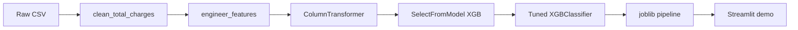

# Enterprise Customer Churn

Predict telecom customer churn and surface actionable retention recommendations. Built as a portfolio project from the [Kaggle Playground Series S6E3](https://www.kaggle.com/competitions/playground-series-s6e3) competition (~594k training rows).

**Holdout ROC-AUC: 0.916** | Recall: 0.88 | Precision: 0.56

## Project background

This repository is a **professional refactor** of my undergraduate group FYP for **CDS4001** (*Enterprise Customer Churn Prediction*). The original work was built in **Google Colab** as a class submission; I restructured it into a modular Python package, four analyst notebooks, a serialized production pipeline, and a Streamlit demo for portfolio and job applications.

The modeling approach and results are unchanged in spirit: custom feature engineering, LR / RF / XGBoost comparison, XGBoost feature selection, and hyperparameters tuned with `RandomizedSearchCV` (ROC-AUC ~0.916 on holdout).

---

## Problem

Telecom providers lose revenue when customers cancel. Churn is imbalanced (~23% positive class) and driven by contract type, tenure, service bundle, and payment behavior. The goal is to **identify at-risk customers early** with high recall so retention teams can intervene before cancellation.

## Data

Download `train.csv` and `test.csv` from the [Kaggle competition page](https://www.kaggle.com/competitions/playground-series-s6e3) and place them in:

```
data/raw/train.csv
data/raw/test.csv
```

These files are gitignored due to size. You need a Kaggle account to download them.

## Key findings

From exploratory analysis (`notebooks/01_eda_and_business_insights.ipynb`):

1. **Month-to-month contracts** churn at ~42% vs ~1% for two-year plans — contract upgrades are the highest-leverage retention lever.
2. **Fiber optic** subscribers churn ~4× more than DSL — competitive pressure and price sensitivity.
3. **Electronic check** payers show the highest churn among payment methods — autopay incentives help.
4. **First-year customers** are especially fragile — proactive onboarding reduces early exits.
5. **High monthly charges + short tenure** signal price-driven churn — targeted loyalty offers help.

## Solution



**Model choice:** XGBoost with `scale_pos_weight` for class imbalance and `SelectFromModel` feature selection. Tuned via 50-iteration `RandomizedSearchCV` (documented in `notebooks/04_production_pipeline.ipynb`). Production training uses **frozen hyperparameters** in `config.yaml` — no search at deploy time.

We optimize for **recall** on the churn class so fewer at-risk customers are missed, accepting lower precision on outreach volume.

## Results

| Model | ROC-AUC | Notes |
|-------|---------|-------|
| Logistic Regression | 0.910 | Fast baseline |
| Random Forest | 0.897 | Strong interpretability |
| XGBoost | 0.915 | Best raw gradient boosting |
| **XGBoost + feature selection (production)** | **0.916** | Deployed pipeline |

Metrics from a stratified 80/20 holdout on the full training set. See `outputs/metrics.json`.

## Tech stack

- Python 3.11, pandas, scikit-learn, XGBoost
- Jupyter notebooks for analyst storytelling
- Streamlit for business-facing demo
- joblib for model serialization

## Quick start

```bash
# Create environment (or use existing conda env)
conda create -n churn-portfolio python=3.11 -y
conda activate churn-portfolio
pip install -r requirements.txt

# Place train.csv and test.csv in data/raw/

# Train production pipeline (~5 min on full data)
python -m src.train

# Launch interactive demo
streamlit run app/streamlit_app.py
```

## Live demo

Deploy to [Streamlit Community Cloud](https://streamlit.io/cloud) (free):

1. Push this repo to GitHub (exclude large CSVs — already in `.gitignore`).
2. On Streamlit Cloud, click **New app** → connect the repo.
3. Set **Main file path** to `app/streamlit_app.py`.
4. Add the trained model: either commit a small sample model or run training in a Cloud build step. For this project, **train locally** and upload `models/churn_xgb_pipeline.joblib` via Git LFS or run `python -m src.train` in a one-off Cloud shell if your plan allows.
5. Copy the deployed URL into this section:

**Live app:** _[Add your Streamlit Cloud URL here]_

## Project structure

```
├── app/
│   └── streamlit_app.py       # Business churn risk demo
├── config.yaml                # Paths, hyperparameters, risk thresholds
├── data/raw/                  # Kaggle CSVs (not committed)
├── models/                    # Serialized pipeline (generated)
├── notebooks/
│   ├── 01_eda_and_business_insights.ipynb
│   ├── 02_feature_engineering.ipynb
│   ├── 03_model_comparison.ipynb
│   └── 04_production_pipeline.ipynb
├── outputs/
│   ├── figures/               # EDA charts from notebooks
│   └── metrics.json           # Holdout metrics for README
├── src/
│   ├── config.py
│   ├── data.py
│   ├── features.py
│   ├── preprocessing.py
│   ├── models.py
│   ├── evaluation.py
│   └── train.py               # CLI: python -m src.train
└── requirements.txt
```

## Author

Portfolio project — enterprise customer churn prediction and retention decision support.
