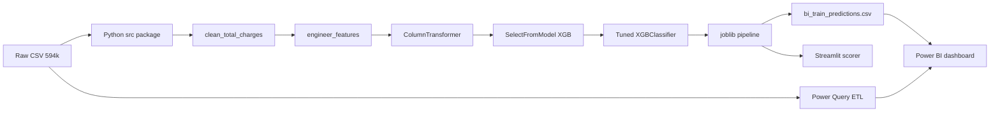
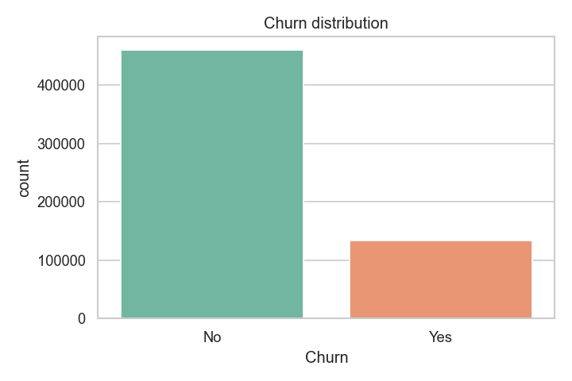
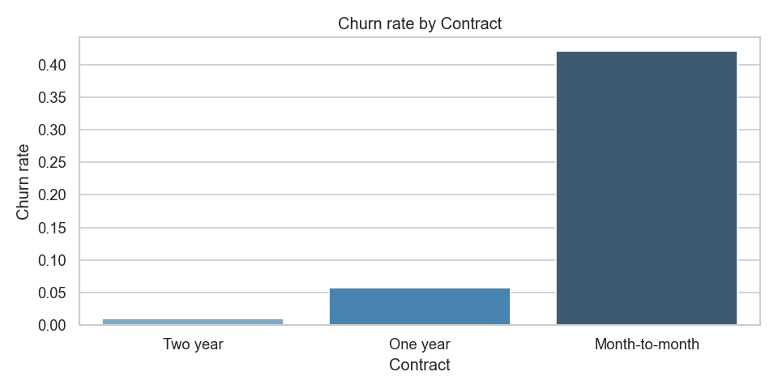
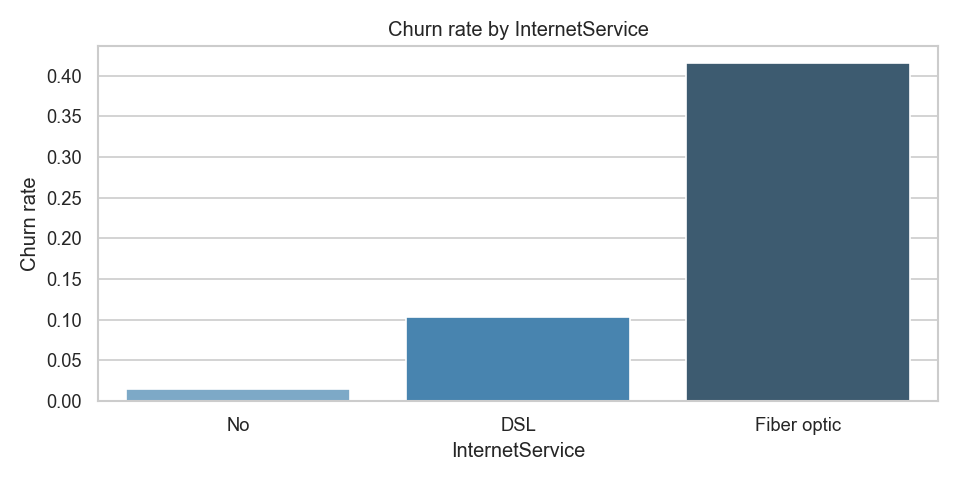
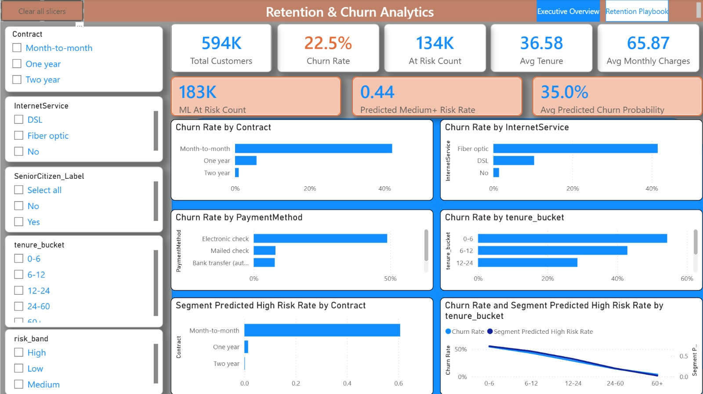
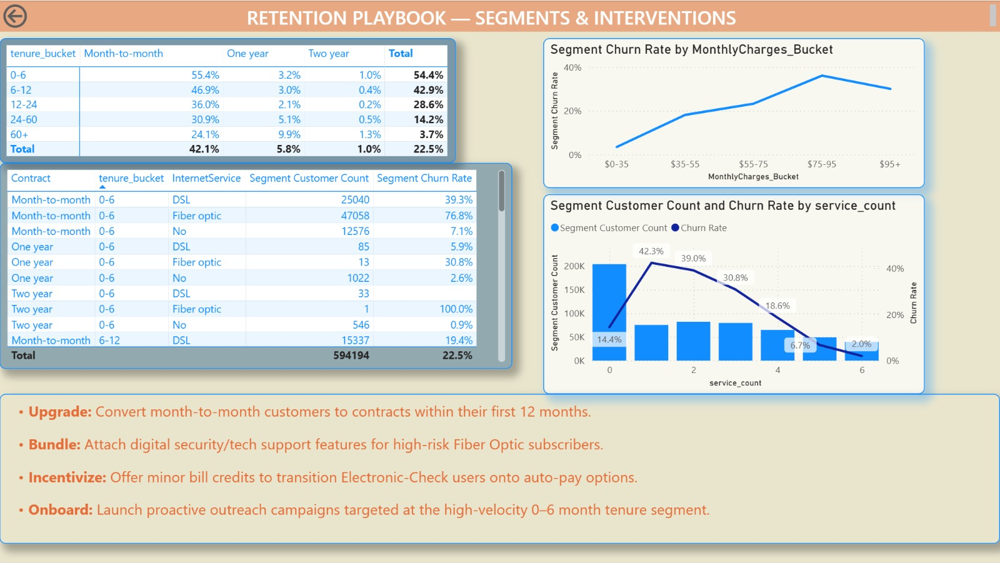

# Enterprise Customer Churn — End-to-End Analytics Portfolio

**GitHub:** [github.com/Rickylam0303/enterprise-customer-churn](https://github.com/Rickylam0303/enterprise-customer-churn) · **Streamlit:** [Live scorer](https://enterprise-customer-churn-9wmrp4azyunsxvecvfpdxa.streamlit.app) · **Power BI:** [`.pbix` report](https://github.com/Rickylam0303/enterprise-customer-churn/tree/master/power-bi)

Telecom customer churn prediction and retention decision support on **594k customers** ([Kaggle Playground Series S6E3](https://www.kaggle.com/competitions/playground-series-s6e3)). Refactored from an undergraduate **CDS4001 group FYP** (Google Colab) into a production-style portfolio spanning **EDA → ML → app → BI**.

| Metric | Value | Business meaning |
|--------|-------|------------------|
| **ROC-AUC** | 0.916 | Strong ranking of at-risk vs retained customers |
| **Recall** | 0.88 | Catches most actual churners — fewer missed interventions |
| **Precision** | 0.56 | Trade-off accepted: prioritize outreach volume over perfect targeting |
| **Dataset scale** | 594,194 rows | Enterprise-scale tabular analytics |

---

## At a glance — what this project demonstrates

| Capability | Deliverable | Tools |
|------------|-------------|-------|
| **Analytics & storytelling** | 4 narrative notebooks + business findings | pandas, matplotlib, seaborn |
| **Machine learning** | Tuned XGBoost pipeline with feature selection | scikit-learn, XGBoost, joblib |
| **Data engineering / ETL** | Reusable `src/` package, predictions export for BI | Python, Power Query (M) |
| **BI & KPI design** | 2-page Power BI retention dashboard | Power BI, DAX |
| **Product delivery** | Live churn risk scorer with recommendations | Streamlit |

**Hiring managers:** Everything below is viewable from this README and linked demos — no local setup required to understand scope and impact.

---

## Business problem

Telecom providers lose recurring revenue when subscribers cancel. Churn is **imbalanced (~23%)** and driven by contract type, tenure, service bundle, and payment behavior.

**Objective:** Identify at-risk customers **early** with high recall so retention teams can act before cancellation — contract upgrades, autopay incentives, and bundled security for fiber subscribers.

---

## End-to-end solution



1. **Explore** — segment churn drivers (contract, internet, payment, tenure).
2. **Model** — XGBoost + `scale_pos_weight` + `SelectFromModel`; hyperparameters frozen in [`config.yaml`](config.yaml) after `RandomizedSearchCV` (documented in notebook 04).
3. **Deploy** — serialized pipeline powers Streamlit; predictions CSV joins ML scores in Power BI.
4. **Decide** — executives use BI for segment KPIs; ops uses Streamlit for single-customer risk.

---

## Key business findings

From [`notebooks/01_eda_and_business_insights.ipynb`](notebooks/01_eda_and_business_insights.ipynb):

1. **Month-to-month contracts** churn at ~42% vs ~1% for two-year plans — contract upgrades are the highest-leverage retention lever.
2. **Fiber optic** subscribers churn ~4× more than DSL — bundle security and support to increase stickiness.
3. **Electronic check** payers show the highest churn among payment methods — autopay incentives reduce friction.
4. **First-year customers** are especially fragile — proactive onboarding in months 0–12 has outsized ROI.
5. **High monthly charges + short tenure** signal price-driven exits — targeted loyalty offers for high-ARPU new customers.

| Overall churn mix | Churn by contract type |
|---|---|
|  |  |



---

## Model results

| Model | ROC-AUC | Role |
|-------|---------|------|
| Logistic Regression | 0.910 | Fast baseline |
| Random Forest | 0.897 | Interpretability reference |
| XGBoost | 0.915 | Best gradient boosting |
| **XGBoost + feature selection (production)** | **0.916** | Deployed in Streamlit + BI export |

Stratified 80/20 holdout on full training set. Details: [`outputs/metrics.json`](outputs/metrics.json).

---

## Live demo — Streamlit churn scorer

**[Open the app →](https://enterprise-customer-churn-9wmrp4azyunsxvecvfpdxa.streamlit.app)**

Enter a customer profile → instant **churn probability**, **risk band** (Low / Medium / High), **key drivers**, and **retention actions**. Built for business users, not data scientists.

---

## Power BI dashboard

Two-page **Retention & Churn Analytics** report in [`power-bi/Executive Overview.pbix`](power-bi/Executive%20Overview.pbix). Connects descriptive analytics with **ML predicted risk** (`predicted_proba`, `risk_band`) exported from Python.



*Executive Overview — KPIs (total customers, churn rate, at-risk count), interactive slicers (contract, internet, tenure, risk band), segment churn charts, and ML metrics (predicted medium+ risk rate, avg predicted probability).*



*Retention Playbook — contract × tenure matrix, price sensitivity by monthly-charge bucket, service-bundle analysis, top-risk segment table, and playbook actions for retention teams.*

### Page summary

| Page | Audience | Contents |
|------|----------|----------|
| **Executive Overview** | Leadership | KPI cards, slicers, churn by contract / payment / tenure / internet, ML risk overlay |
| **Retention Playbook** | Retention ops | Segment matrix, price bands, service counts, ranked high-risk segments, action bullets |

### BI stack (SQL-adjacent skills)

| Layer | Implementation |
|-------|----------------|
| **ETL** | Power Query (M) — type coercion, tenure buckets, ML CSV join ([`power-bi/queries/LoadTrain.m`](power-bi/queries/LoadTrain.m)) |
| **Metrics** | DAX measures — `Churn Rate`, `At Risk Count`, segment rates, ML KPIs ([`power-bi/measures/ChurnMeasures.dax`](power-bi/measures/ChurnMeasures.dax)) |
| **ML bridge** | `python -m src.export_predictions` → `outputs/bi_train_predictions.csv` |

---

## Project background

Undergraduate group FYP for **CDS4001** (*Enterprise Customer Churn Prediction*), originally built in Google Colab. Independently refactored into this repository: modular Python package, four analyst notebooks, training CLI, Streamlit demo, and Power BI dashboard — suitable for data analyst and analytics-ML portfolio use.

---

## Tech stack

Python 3.11 · pandas · scikit-learn · XGBoost · Streamlit · Power BI · Power Query · DAX · Jupyter · joblib

---

## Quick start (developers)

From project root with `conda activate churn-portfolio`:

```bash
pip install -r requirements.txt
# Place train.csv and test.csv in data/raw/

python -m src.train                  # ~5 min — saves models/churn_xgb_pipeline.joblib
python -m src.export_predictions     # BI predictions CSV
streamlit run app/streamlit_app.py
```

Open [`power-bi/Executive Overview.pbix`](power-bi/Executive%20Overview.pbix) in Power BI Desktop; update `ProjectRoot` in Power Query to your local path.

---

## Project structure

```
├── app/streamlit_app.py              # Live churn risk demo
├── images/                           # README dashboard screenshots
├── power-bi/
│   ├── Executive Overview.pbix       # 2-page dashboard
│   ├── queries/LoadTrain.m           # Power Query ETL
│   └── measures/ChurnMeasures.dax    # DAX measures
├── notebooks/01–04                   # EDA → features → models → production
├── src/                              # data, features, models, train, export_predictions
├── outputs/figures/                  # EDA charts
├── config.yaml                       # Paths, hyperparameters, risk thresholds
└── requirements.txt
```

---

## Author

Portfolio project — enterprise customer churn prediction and retention decision support.
